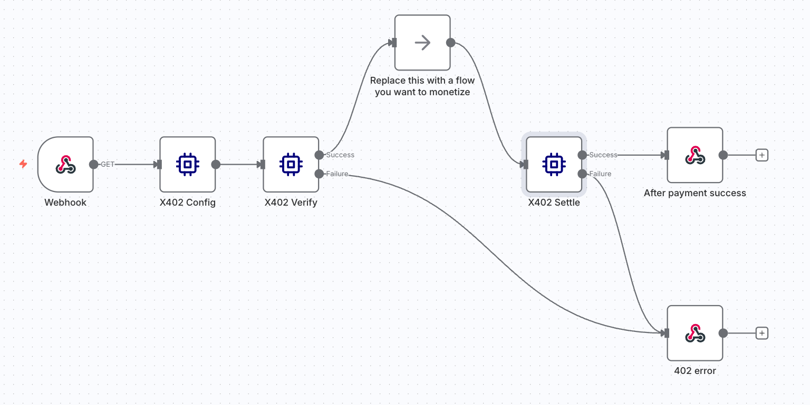

# n8n-nodes-x402

This is an n8n community node. It lets you use [x402](https://www.x402.org/) in your n8n workflows.

x402 is an open payment standard that enables AI agents and web services to autonomously pay for
API access, data, and digital services. By leveraging the long-reserved HTTP 402 ”Payment Required”
status code, x402 eliminates the need for API keys, subscriptions, and manual payment processing,
allowing real-time, machine-native transactions using stablecoins like USDC.

[n8n](https://n8n.io/) is a [fair-code licensed](https://docs.n8n.io/sustainable-use-license/) workflow automation platform.

[Installation](#installation)  
[Operations](#operations)  
[Compatibility](#compatibility)  
[Usage](#usage)  
[Resources](#resources)  
[Version history](#version-history)  

## Installation

Follow the [installation guide](https://docs.n8n.io/integrations/community-nodes/installation/) in the n8n community nodes documentation.

To install the x402 node, go to your user settings and select _Community nodes_ in the left-hand navigation bar.
Search for `n8n-nodes-x402` and click the _Install_ button.

## Operations

The x402 node allows users to wrap their workflows with x402 standard and monetize them.

## Compatibility

The `n8n-nodes-x402` node is compatible with n8n version 1.118.2 and later.

## Usage

1. Import the [x402 starter workflow](./docs/workflows/starter.json) into n8n.

2. Configure the x402 config by editing the `Config` node.
Check the [x402 docs](https://x402.gitbook.io/x402) for more info on how to configure the x402 node.

3. Replace the `Replace this with a flow you want to monetize` node with your own workflow.

## Resources

* [n8n community nodes documentation](https://docs.n8n.io/integrations/#community-nodes)
* [x402 documentation](https://x402.gitbook.io/x402)

## Version history

latest version: `0.1.0`
